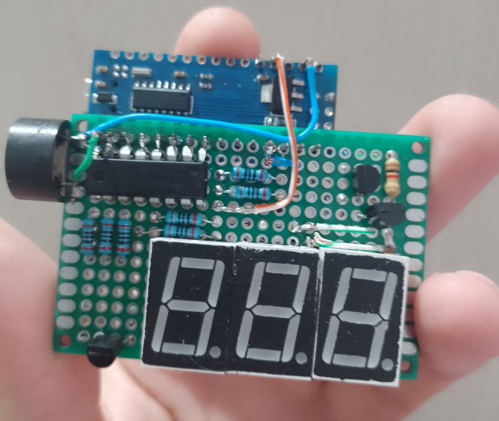

# Ticking Threat ⏱
A dramatic countdown timer that feels straight out of an action film.  
This project uses a single BCD-to-7-segment decoder to multiplex multiple displays, paired with a buzzer that beeps every second, mimicking the suspenseful countdown of a movie bomb.

## Purpose
The main goal of this project is to demonstrate how to control multiple 7-segment displays using only **one decoder** (such as the CD4511), by taking advantage of **display multiplexing** techniques. The buzzer adds an auditory element for a more immersive experience.

## Hardware

- 3× Common-cathode 7-segment displays(**5161AS**)
- 1× BCD to 7-segment decoder (**CD4511**)
- 1× Buzzer (active or passive)
- 3x NPN transistors for digit control (**BC337**)
- 1x Arduino Nano
- 10x Resistors
  - 7x 1kΩ (for current limiting)
  - 3x ~2.2kΩ (transistor's base control)

## Circuit Overview

- The CD4511 receives 4-bit BCD inputs from the microcontroller and drives the segment lines.
- Only one display is activated at a time via a transistor connected to its common cathode.
- The microcontroller rapidly cycles through the digits, updating the segment data and enabling each digit in turn.
- This time-multiplexing technique creates the appearance of a stable, simultaneous display.

## 🎬 Demo

Watch the video demo here: [YouTube – Ticking Threat](https://www.youtube.com/watch?v=INegOfn2tVk)
